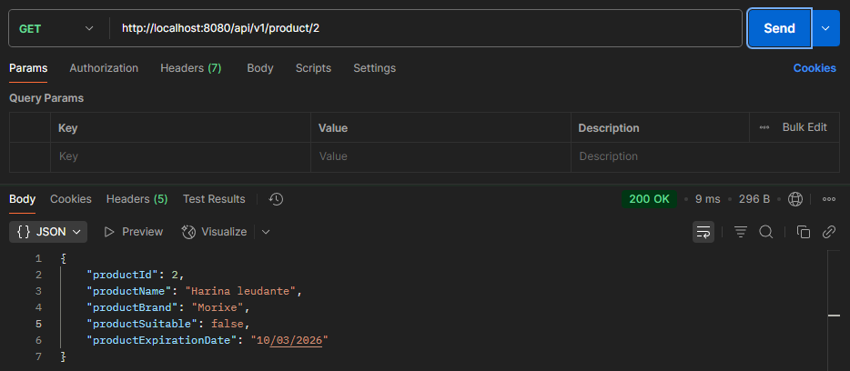
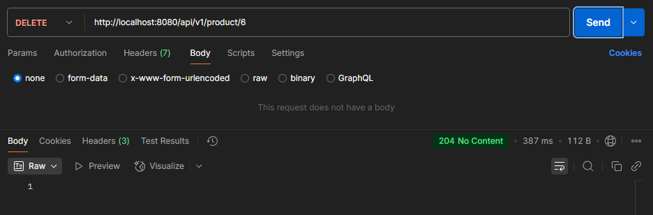

# API RESTful para gestión de productos alimenticios.

API RESTful desarrollada con Spring Boot para gestionar productos. Permite crear, consultar, eliminar y notificar fechas
de expiración de cada producto.
Proyecto realizado como challenge para ITBA.

---

## Setup

### Requisitos

* Java 21.0.7 (https://www.oracle.com/java/technologies/downloads/#java21)
* Maven 3.9+ (https://maven.apache.org/download.cgi)
* Docker Desktop (https://www.docker.com/products/docker-desktop/)

---

## ¿Cómo levantar y compilar el proyecto?

### Localmente

* Clonar el repositorio

```bash
   git clone https://github.com/cassirambd/itba-spring-boot-challenge.git
   cd itba-spring-boot-challenge
   cd challenge
```

* Ejecutar el comando `mvn clean install`
* Ejecutar el comando `mvn spring-boot:run`
* Acceder a la API: `http://localhost:8080/api/v1/product`
* Acceder a la consola de H2: `http://localhost:8080/h2-console`

### Vía Docker

```bash
   docker build -t challenge .
   docker run -p 8080:8080 challenge
```

---

## Endpoints

### Swagger

* Acceder a https://editor.swagger.io/
* Importar o copiar el contenido del archivo challenge-api.yaml que se encuentra dentro de la carpeta docs y pegarlo en
  el editor.

### Postman/Curl

### Obtener todos los productos

```
curl --location 'http://localhost:8080/api/v1/product/list'
```


### Obtener producto según id

```
curl --location 'http://localhost:8080/api/v1/product/2'
```



### Crear nuevo producto

```
curl --location 'http://localhost:8080/api/v1/product' \
--header 'Content-Type: application/json' \
--data '{
  "productName": "Tallarín",
  "productSuitable": false,
  "productBrand": "Lucchetti",
  "productExpirationDate": "2026-02-24"
}'
```


### Actualizar producto

```
curl --location --request PUT 'http://localhost:8080/api/v1/product' \
--header 'Content-Type: application/json' \
--data '{
  "productId": "5",
  "productName": "Mostachol",
  "productSuitable": true,
  "productBrand": "Lucchetti",
  "productExpirationDate": "2026-02-24"
}'
```


### Eliminar producto

```
curl --location --request DELETE 'http://localhost:8080/api/v1/product/5'
```

